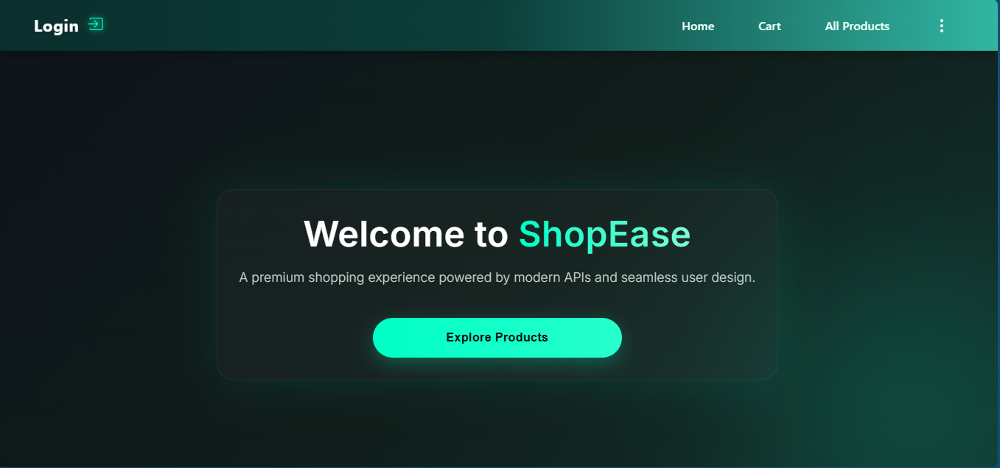
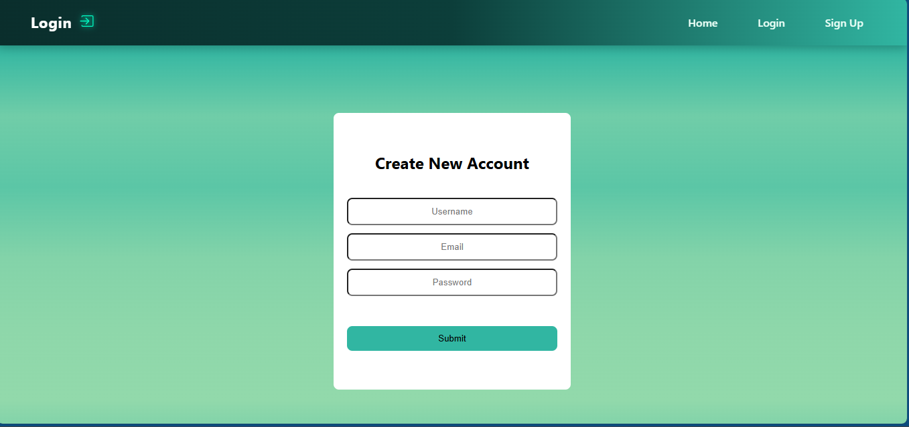
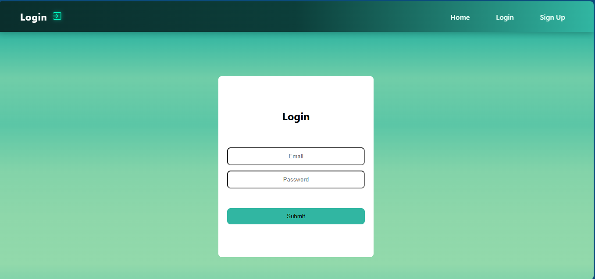
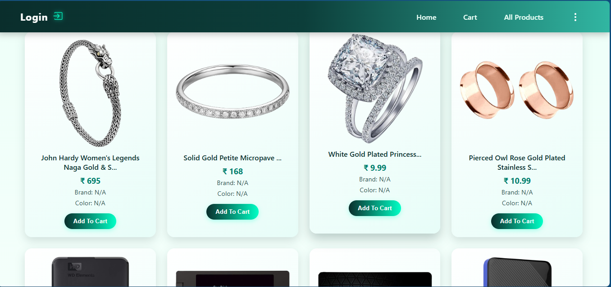
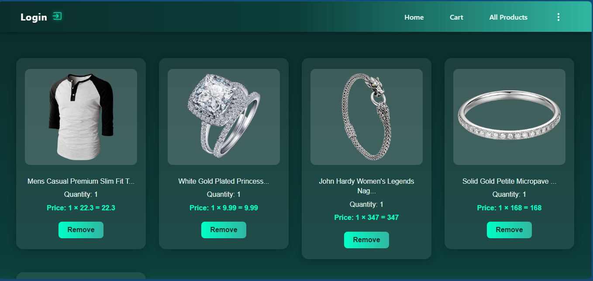

# ShopEase – React E-commerce Application

## Overview

ShopEase is a responsive and dynamic e-commerce web application built using React.js. It allows users to browse products, manage their cart, and interact with a clean and user-friendly interface.

This project demonstrates core frontend development skills like component-based architecture, routing, and state management.

---

## Features
- Add to Cart functionality
- Product listing (All Products page)
- User Authentication UI (Login & Signup)
- Edit Profile functionality
- Page navigation using React Router
- Fully responsive design
- Modular component structure

---

## Tech Stack
- Frontend: React.js
- Routing: React Router DOM
- Styling: CSS Modules / Global CSS
- State Management: React Hooks (useState)

---

## Project Structure

```
src/
│── component/
│   ├── allproducts/
│   ├── cart/
│   ├── editProfile/
│   ├── home/
│   ├── login/
│   ├── signup/
│
│── navbar/
│   ├── Navbar.jsx
│   └── Navbar.module.css
│
│── routing/
│   └── Routing.jsx
│
│── App.jsx
│── main.jsx
│── global.css

```

---

## Installation & Setup

1. Clone the repository
```
git clone https://github.com/priyankamourya/ShopEase.git
```

2. Navigate to project folder
```
cd ShopEase
```

3. Install dependencies
```
npm install
```

4. Run the application
```
npm run dev
```
---

## Screenshots

### Home Page


### SignUp Page


### Login Page


### Products Page


### Cart Page


---

## Future Improvements
 
- Backend Integration (Spring Boot / Node.js)
- Payment Gateway Integration
- Wishlist Feature
- Advanced product filtering & search
- Complete authentication system with API

---

## What I Learned

- Building scalable React component structure
- Implementing routing using React Router
- Managing UI state using hooks
- Creating reusable components
- Structuring real-world frontend projects

---
## Contact
```
GitHub: https://github.com/priyankamourya
```
---

## Author

Priyanka Maurya

---

## Support

If you like this project, don’t forget to ⭐ the repo!
